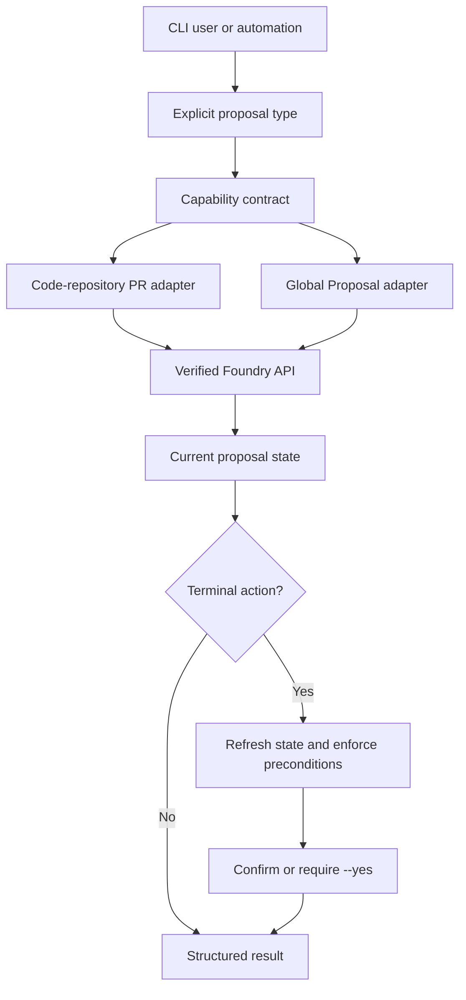

# feat: Unified Proposal Lifecycle

## Summary

Add a typed `pltr proposal` command family for Foundry code-repository pull requests and Ontology Global Proposals. The work begins with a fail-closed direct-API feasibility gate; only verified, authorized lifecycle actions become executable CLI commands.

---

## Problem Frame

The CLI has no proposal lifecycle surface. Generic resources and dataset branches cannot create, review, comment on, approve, merge, accept, or close the two distinct Foundry proposal types. Published MCP capability covers only a subset, so the CLI must not conflate provider semantics or fabricate unsupported completion behavior.

---

## Requirements Traceability

- Unified typed commands: R1–R5, AE1–AE2.
- Safe terminal actions: R6–R9, AE3–AE4.
- Automation and output consistency: R10–R12.
- Actors and flows: A1–A3, F1–F3.

---

## High-Level Technical Design

The command layer owns argument validation, confirmation, exit behavior, and output. A dedicated proposal service owns type-specific Foundry calls and translates provider responses into one stable proposal model. Every action is capability-gated before it can issue a remote mutation.

---

## Key Technical Decisions

- **Fail closed on unknown APIs.** The first unit verifies actual authenticated API calls and permissions. Unsupported or unverified actions return a typed unsupported-capability failure; they never redirect to UI or claim success.
- **Require proposal type.** `code-pr` and `global-proposal` share verbs but retain separate identity, review, and terminal semantics.
- **Refresh before terminal writes.** Merge, accept, and close re-read state immediately before mutation and reject stale, blocked, or unauthorized requests.
- **Define proposal errors explicitly.** Add a proposal-specific error taxonomy and nonzero exit mapping for authentication, authorization, validation, conflict, unsupported capability, and remote-service failures; existing services do not supply this complete hierarchy.

---

## Implementation Units

### U1. Verify Foundry lifecycle capabilities

**Goal:** Establish a source-backed contract for every requested lifecycle action before application commands rely on it.

**Requirements:** R4–R7, R9, R12; F2–F3; AE2–AE4.

**Dependencies:** None.

**Files:** `docs/plans/2026-07-19-unified-proposal-lifecycle-capability-matrix.md`, `tests/integration/conftest.py`, `tests/integration/test_proposal_capabilities.py`.

**Approach:** Define the opt-in real-provider environment contract: required target identifiers, credentials, scopes, disposable-resource ownership, cleanup, and skip-if-unconfigured behavior. Against that target, probe every type/action pair for callable endpoints, request shapes, scopes, response states, and an optimistic-concurrency precondition. Commit the resulting allow-list matrix. An absent live target leaves every write action unverified; a missing endpoint, scope, comment capability, review decision, merge/accept operation, or concurrency primitive leaves that pair unsupported.

**Patterns to follow:** Existing profile authentication in `tests/conftest.py` and service construction conventions in `src/pltr/services/base.py`.

**Test scenarios:**
- Skip real-provider probes only when the explicit integration environment contract is absent; never substitute fake evidence.
- Authenticate against the configured target and enumerate supported actions without changing data.
- Exercise each candidate terminal action only on disposable resources and record its server-side revision/precondition behavior.
- Verify unavailable endpoint, missing permission, missing concurrency primitive, and invalid request shape are distinguishable.

**Verification:** The committed matrix identifies each allow-listed provider operation, scope, success response, failure response, and concurrency primitive. All other pairs are deny-by-default, and no terminal-action implementation proceeds without this evidence.

### U2. Add typed proposal domain and capability service

**Goal:** Provide one internal proposal model and type-aware service boundary for verified Foundry operations.

**Requirements:** R1–R6, R9–R12; A1–A3; F1–F3.

**Dependencies:** U1.

**Files:** `src/pltr/services/proposal.py`, `src/pltr/services/base.py`, `tests/test_services/test_proposal.py`.

**Approach:** Define the stable proposal identity, normalized state, comments, review decision, terminal-action capability, and provider-specific adapter behavior. Define the proposal-specific six-category error taxonomy and map it to deterministic nonzero exits. Build only matrix-allow-listed calls from U1; every other type/action pair returns unsupported capability before provider mutation.

**Patterns to follow:** `src/pltr/services/base.py` serialization; existing service modules’ profile-aware constructor pattern; `src/pltr/auth/base.py` authentication error handling.

**Test scenarios:**
- Covers AE1. Normalize code PR and Global Proposal responses without crossing their identities.
- Covers AE2. Persist type-appropriate comment and review-decision results in the normalized read model only when allow-listed.
- Covers AE4. An unverified type/action returns unsupported capability before any provider mutation.
- Map authentication, authorization, validation, conflict, unsupported capability, and remote-service failures into distinct domain errors and exits.

**Verification:** Unit tests prove that command consumers receive one stable result shape, deterministic error categories, and deny-by-default behavior for unsupported pairs.

### U3. Expose unified proposal commands

**Goal:** Register a first-class `pltr proposal` command group for every matrix-allow-listed lifecycle verb.

**Requirements:** R1–R5, R8–R12; A1–A3; F1–F2.

**Dependencies:** U1, U2.

**Files:** `src/pltr/commands/proposal.py`, `src/pltr/cli.py`, `tests/test_commands/test_proposal.py`.

**Approach:** Add a Typer sub-app that requires proposal type for every operation and delegates all provider behavior to the proposal service. Register common reads and only allow-list verified type/action pairs; expose other requested verbs as explicit unsupported-capability failures rather than omitting, inferring, or falling back. Apply the established profile option, machine-readable output convention, and nonzero exit behavior.

**Patterns to follow:** Sub-app registration in `src/pltr/cli.py`; option, service construction, and formatted output patterns in existing command modules.

**Test scenarios:**
- Covers AE1. Create/list/get routes type and identifiers to the correct allow-listed service operation.
- Covers AE2. Comment, approve, and request-changes commands serialize successful results without status text in JSON mode only when verified.
- Missing proposal type, malformed identifier, and every unsupported type/verb pair exit nonzero with the unsupported-capability category.
- Every network command forwards its selected profile.

**Verification:** Command tests demonstrate consistent help, argument validation, structured output, service delegation, and explicit deny behavior across both types.

### U4. Enforce safe terminal actions

**Goal:** Make merge, accept, and close safe for interactive and automated users.

**Requirements:** R6–R9, R12; F3; AE3–AE4.

**Dependencies:** U2, U3.

**Files:** `src/pltr/commands/proposal.py`, `src/pltr/services/proposal.py`, `tests/test_commands/test_proposal.py`, `tests/test_services/test_proposal.py`.

**Approach:** Before any terminal write, fetch fresh proposal state and enforce the matrix-verified server-side optimistic-concurrency precondition from U1. Display the exact target in interactive mode and require confirmation unless `--yes` is supplied. Execute only the allow-listed type-appropriate operation. A terminal action without a verified atomic precondition remains unsupported; refresh-only best effort is prohibited.

**Patterns to follow:** Confirmation and `--yes` treatment in `src/pltr/commands/dataset.py` branch deletion.

**Test scenarios:**
- Covers AE3. A changed head/state between inspection and execution prevents merge or accept through the verified provider precondition.
- Interactive terminal action cancels cleanly when confirmation is declined.
- `--yes` bypasses only the prompt, not refresh or provider preconditions.
- A terminal action with no verified concurrency primitive, plus blocked, unauthorized, unsupported, and provider-failed actions, never report success.

**Verification:** Tests demonstrate that no terminal write occurs without an allow-listed capability, a verified atomic precondition, fresh valid state, and explicit interactive or automation intent.

### U5. Document the lifecycle and verify real-provider behavior

**Goal:** Make the capability matrix and operator workflow discoverable, and cover verified provider behavior end-to-end.

**Requirements:** R1–R12; A1–A3; F1–F3; AE1–AE4.

**Dependencies:** U3, U4.

**Files:** `docs/user-guide/proposals.md`, `docs/user-guide/commands.md`, `README.md`, `tests/integration/test_proposal_workflow.py`.

**Approach:** Document type selection, supported lifecycle actions, confirmation and `--yes`, structured output, required permissions, and explicit unsupported-action behavior. Add integration coverage only for capabilities verified by U1 and isolate all mutable tests to disposable provider resources.

**Test scenarios:**
- Author raises and retrieves each verified proposal type.
- Reviewer comments and records each verified decision type.
- Automation completes each verified terminal action with `--yes`.
- Unsupported lifecycle actions fail without UI fallback or simulated completion.

**Verification:** Documentation matches the U1 capability matrix and integration tests prove each documented executable path against the real provider contract.

---

## Risks and Dependencies

- **Primary dependency:** Foundry may not expose callable APIs or sufficient scopes for approval, merge, or Global Proposal acceptance. U1 is a hard gate; the scope narrows to explicit unsupported-capability behavior for any unverified action.
- **State-race risk:** Provider proposal state can change after initial inspection. U4 must rely on verified revision/precondition semantics rather than client-side timing assumptions.
- **External-contract risk:** The local MCP launcher/catalog is not an authoritative provider contract. Official authenticated API verification takes precedence.
- **Safety risk:** Terminal actions are irreversible or consequential. Preserve confirmation, fresh-state checks, and truthful errors.

---

## Scope Boundaries

- Dataset branches, transactions, widget repositories, GitHub contributor pull requests, and alias merging remain out of scope.
- The CLI will not infer proposal type.
- The CLI will not launch or redirect to Foundry UI as a fallback.
- Unverified provider writes are not emulated, mocked as success, or exposed as executable commands.

### Deferred to Follow-Up Work

- Broader repository branch CRUD and branch-policy management.
- UI parity beyond the explicitly verified proposal lifecycle.
- Caching proposal state beyond each command invocation.

---

## Sources and Existing Patterns

- Origin requirements: `docs/brainstorms/2026-07-19-unified-proposal-lifecycle-requirements.md`.
- CLI registration: `src/pltr/cli.py`.
- Confirmation precedent: `src/pltr/commands/dataset.py`.
- Service and error conventions: `src/pltr/services/base.py`.
- Command test patterns: `tests/test_commands/test_dataset.py`, `tests/test_commands/test_ontology.py`.
- Service test patterns: `tests/test_services/`.
