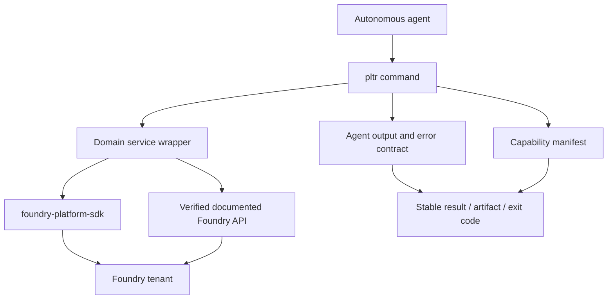

# feat: Build a native agent-first Foundry CLI with MCP-level parity

## Summary

Replace the current Palantir MCP launcher with a native, agent-first Foundry CLI. The CLI will use the documented Palantir MCP tool catalog as a parity benchmark, but it will implement capabilities through `foundry-platform-sdk` or verified Foundry APIs instead of invoking MCP, Node, or the private `@palantir/mcp` package.

The finished CLI must expose a stable machine-readable interface, cover every currently documented MCP capability with an equivalent command or a stronger CLI workflow, and fail explicitly when a public SDK/API contract cannot support a capability. An unresolved parity row is a release blocker, not a silently accepted gap.

---

## Problem Frame

`pltr-cli` already provides substantial Foundry coverage, but its MCP command is only a wrapper around the official Node launcher. That makes the CLI dependent on a separate runtime, leaves agent-facing output inconsistent, and leaves major MCP capability areas absent from the native command/service architecture.

The desired product is a self-contained CLI that autonomous agents can use for discovery, analysis, mutation, verification, and developer workflows. Human-friendly tables remain supported, but stable machine output, deterministic errors, pagination, safety gates, and capability discoverability become first-class contracts.

---

## Requirements

### Agent-native contract

- R1. The CLI runs all parity capabilities without invoking MCP, Node, `npx`, or the private `@palantir/mcp` package.
- R2. Every command supports a stable agent output mode with typed success, pagination, warnings, errors, and artifact references; existing human output remains available during migration.
- R3. Agent invocations are non-interactive by default when requested, use explicit confirmation for destructive operations, and return deterministic exit codes.
- R4. `pltr capabilities --format agent` exposes a versioned capability manifest mapping every parity capability to its command, service, API contract, test coverage, and implementation status.

### Foundry capability parity

- R5. The CLI provides native equivalents for all currently documented Palantir MCP Compass, dataset, lineage, ontology, object-set, OSDK, Platform SDK, code repository, global branching, Developer Console, compute module, data connection, and documentation capabilities, including documented workflow-only capabilities such as transform preview that are not rows in the available-tools table.
- R6. The CLI supports both RID and documented path inputs where the Foundry API supports them, while preserving RID-first semantics for commands whose API contract requires RIDs.
- R7. Every paginated capability exposes resumable page tokens and an agent-safe way to request all pages within explicit limits.
- R8. Dataset builds, jobs, transform previews, status, historical search, statistics, and lineage are available without requiring agents to translate between unrelated command groups.
- R9. Ontology inspection supports entity search, function search, object/link/action metadata, object queries, aggregations, and related schema lifecycle operations.
- R10. Code repository, pull request, Developer Console, OSDK, compute module, REST data source, webhook, egress policy, and Foundry documentation workflows are exposed through native command groups.

### Safety and correctness

- R11. Ontology, dataset, project, connection, webhook, compute, and repository mutations validate inputs and use explicit confirmation or proposal workflows where the Foundry contract requires them.
- R12. Any command that changes a Foundry ontology resource, action, query, dataset, application, or other Compass resource enforces the repository's dependency/change-impact workflow before mutation.
- R13. The implementation uses only verified SDK methods or documented API contracts. Unsupported SDK behavior is not guessed or represented as successful parity.
- R14. Authentication reuses profile, token, OAuth, keyring, environment, timeout, and permission conventions already established by the CLI, with no credential leakage in output, logs, or configuration files.

### Quality and maintainability

- R15. Each capability has service-layer tests, command-layer tests, error-path coverage, and integration coverage when it crosses SDK/API boundaries.
- R16. The parity manifest cannot report a capability as implemented unless its command, service operation, contract evidence, and tests are present.
- R17. README, user guides, the canonical `skills/pltr-cli/` bundle, changelog, and migration documentation describe the native CLI as the product surface and remove MCP as a required dependency.
- R18. The complete test, lint, type-check, security, and parity verification gates pass before the feature is considered complete.

---

## Scope Boundaries

### In scope

- Native CLI equivalents for the current documented Palantir MCP capability catalog.
- Agent-first output, errors, pagination, safety, capability discovery, and operational limits.
- Removal of MCP launcher/configuration code from the product path.
- SDK/API capability audit, service wrappers, Typer commands, tests, documentation, and migration guidance.

### Deferred to follow-up work

- New Foundry features added after the parity catalog baseline is recorded.
- Full local caching or offline snapshots of Foundry metadata.
- A general-purpose LLM, planning engine, or autonomous workflow runner inside `pltr-cli`.
- Browser automation for capabilities that are not available through a documented Foundry API.

### Outside this product's identity

- Implementing or redistributing Palantir's private MCP server.
- Maintaining an MCP protocol server as a required CLI feature.
- Reproducing private Foundry package internals or bypassing tenant permissions.

---

## High-Level Technical Design



The service layer remains the single implementation boundary. Commands translate user or agent input into typed service calls; services own API contracts, pagination, serialization, error classification, and permission context. The capability manifest is generated from explicit registrations rather than manually maintained prose.

Each feature unit follows the same lifecycle: capability evidence first, service wrapper second, command surface third, tests fourth, documentation fifth. A capability is not complete when a command exists; it is complete when the manifest, service contract, output schema, safety behavior, and tests agree.

---

## Key Technical Decisions

- KTD1. **Native services, no MCP adapter.** Do not expose the official MCP package through the CLI or reimplement its private server. The CLI calls verified SDK/API surfaces directly.
- KTD2. **Versioned parity baseline.** Record the current 72-tool catalog plus documented workflow-only capabilities, source URL, retrieval date, and catalog version in the manifest. Future catalog changes create explicit parity work instead of silently changing scope.
- KTD3. **Agent output is additive first.** Add a stable `agent` output mode and preserve existing table/JSON/CSV behavior until every command group has migrated and regression consumers are documented.
- KTD4. **Manifest-driven completeness.** Capability registrations define command, service, API evidence, input contract, output schema, mutation risk, and test references. CI fails on missing or stale registrations.
- KTD5. **SDK-first, documented-API second.** Prefer the pinned SDK. Use direct HTTP only for a verified documented endpoint with an explicit contract test. Never infer an endpoint from an MCP tool name.
- KTD6. **Safety is part of parity.** Equivalent functionality includes confirmation, proposal/change-impact gates, permission handling, and fail-closed behavior; a destructive command without those controls is not parity.
- KTD7. **Stable machine semantics.** Agent output uses explicit `data`, `meta`, `warnings`, `errors`, `pagination`, and `artifacts` fields. Human rendering is a projection of the same service result, not a separate implementation.
- KTD8. **Explicit limits everywhere.** Every list/build/log/search operation exposes page, item, request, and time limits. Agents can request continuation without parsing human prose.

---

## Parity Baseline

The baseline is the current Palantir documentation page, `palantir-mcp/available-tools`, checked on 2026-07-20. The manifest must preserve the exact source and date. The following groups contain all 72 documented tool capabilities. The manifest also records workflow-only capabilities described elsewhere in the official documentation, including `preview_transform`, even when they are absent from the available-tools table.

| Group | Native command family | Capabilities |
|---|---|---|
| Compass | `resource`, `project`, `namespace` | folder resources, project imports, namespaces, templates, project creation, project search |
| Dataset | `dataset`, `build`, `job`, `lineage` | schema, SQL, create/write, files, builds, build status/search, job status, statistics |
| Ontology | `ontology`, `functions` | ontology RID, ontology/function search, object/link/action view and lifecycle |
| Object set | `ontology object` | object query and aggregation |
| OSDK / Platform SDK | `osdk`, `platform-sdk` | SDK context/examples, API inventory/reference |
| Code repository | `repository` | repository context/create/clone and pull request operations |
| Global branching | `branch`, `proposal` | branch and proposal lifecycle |
| Developer Console | `dev-console` | application connection, React conversion, SDK generation/install, OSDK definition |
| Compute modules | `compute` | documentation, info, logs, lifecycle, function execution |
| Data connections | `connectivity rest-source`, `connectivity webhook`, `connectivity egress` | REST data source, webhook lifecycle, network egress policy |
| Documentation | `docs` | Python/TypeScript/widget/ML/Spark/React docs, page loading, summaries, search |

The implementation manifest must enumerate individual tool names, not only these groups, including the 72 tool rows below. It must separately enumerate workflow rows such as `preview_transform` with `kind: workflow`, so tool-count checks cannot hide documented agent workflows.

```text
list_resources_in_foundry_folder
get_project_imports
list_foundry_namespaces
list_foundry_project_templates
create_foundry_project
search_foundry_projects
get_foundry_dataset_schema
run_sql_query_on_foundry_dataset
create_and_write_to_foundry_dataset
list_dataset_files
build_datasets
get_build_status
search_dataset_builds
get_job_status
get_dataset_stats
get_resource_graph
get_foundry_ontology_rid
search_foundry_ontology
search_foundry_functions
view_foundry_object_type
create_or_update_foundry_object_type
delete_foundry_object_type
view_foundry_link_type
create_or_update_foundry_link_type
delete_foundry_link_type
view_foundry_action_type
create_or_update_foundry_action_type
delete_foundry_action_type
query_ontology_objects
aggregate_ontology_objects
get_ontology_sdk_context
get_ontology_sdk_examples
list_platform_sdk_apis
get_platform_sdk_api_reference
get_repository_context
create_python_transforms_code_repository
clone_code_repository_locally
create_code_repository_pull_request
list_code_repository_pull_requests
get_code_repository_pull_request
create_code_repository_pull_request_comment
create_global_branch
view_global_branch
close_global_branch
create_global_proposal
view_global_proposal
close_global_proposal
connect_to_dev_console_app
convert_to_osdk_react
generate_new_ontology_sdk_version
install_sdk_package
view_osdk_definition
get_compute_modules_documentation
get_compute_modules_info
get_compute_modules_logs
manage_compute_modules
execute_compute_modules_function
create_foundry_rest_api_data_source
create_foundry_rest_api_data_source_webhook
update_foundry_rest_api_data_source_webhook
view_foundry_rest_api_data_source_webhook
get_or_create_network_egress_policy
get_python_transforms_documentation
get_typescript_v1_functions_documentation
get_typescript_v2_functions_documentation
get_custom_widget_documentation
get_ml_documentation
get_spark_profile_documentation
get_osdk_react_components_documentation
load_foundry_documentation_page
get_documentation_summaries
search_foundry_documentation
```

---

## System-Wide Impact

- **Authentication:** Existing profiles and keyring storage remain the credential source. Direct HTTP wrappers must use the same auth manager and must never serialize tokens.
- **CLI compatibility:** Removing `mcp` is a breaking user-facing change. The release must include a migration note explaining that native `pltr` commands replace MCP setup and that existing `mcp init/serve` workflows are intentionally removed.
- **API contracts:** New service methods are public internal contracts consumed by commands, tests, docs, and agents. They require stable schemas and contract tests.
- **Safety:** Ontology and Compass mutations require the existing change-impact gate and explicit operator intent. This plan does not authorize live Foundry mutations.
- **Performance:** Agent workflows may fan out across metadata and paginated resources. Shared request/page/item/time budgets and bounded concurrency are required.
- **Documentation:** The canonical skill bundle becomes the primary agent onboarding surface and must describe commands as the only supported Foundry agent interface.

---

## Risks and Dependencies

| Risk | Impact | Mitigation |
|---|---|---|
| SDK 1.95.0 lacks some parity operations | High | Capability audit before implementation; use only verified API contracts; unresolved rows block parity completion |
| MCP catalog changes during buildout | Medium | Version/date the manifest and add catalog-diff checks |
| Direct HTTP endpoints drift | High | Isolate them in services, pin documented request/response schemas, add contract tests, and prefer SDK methods |
| Large feature surface causes inconsistent UX | High | Shared agent result/error/pagination contract and manifest-driven tests |
| Mutations bypass change-impact or confirmation safety | High | Central mutation guard, command-level confirmation tests, security review |
| Removing MCP breaks existing users | Medium | Explicit breaking-change release note and migration guide |
| Agent output leaks credentials or sensitive payloads | High | Redaction tests, safe error serialization, no raw headers, output policy review |
| Full parity is too large for one execution batch | Medium | Keep eight dependency-ordered units; do not declare completion until the manifest gate passes |

Dependencies:

- The existing `foundry-platform-sdk` pin and generated method surface must be audited before each capability group.
- Public Foundry API permissions and tenant feature availability must be represented in integration fixtures and explicit runtime errors.
- Mutation units depend on the agent output, capability manifest, and safety guard established by U1/U2.
- The final parity gate depends on all capability units and their documentation/test references.

---

## Implementation Units

### U1. Capability manifest and verified API contract registry

- **Goal:** Create the versioned, machine-readable parity ledger and the contract registry that prevents undocumented or untested capabilities from being marked complete.
- **Requirements:** R4, R5, R13, R16.
- **Dependencies:** None.
- **Files:** `src/pltr/capabilities.py`, `src/pltr/commands/capabilities.py`, `src/pltr/cli.py`, `docs/capabilities/foundry-agent-capabilities.json`, `tests/test_capabilities.py`, `tests/test_commands/test_capabilities.py`.
- **Approach:** Register each baseline capability with its native command, service, SDK/API evidence, mutation classification, output schema, and test references. Expose manifest inspection as a CLI command. Add validation that rejects duplicate IDs, missing command mappings, missing evidence, stale statuses, and missing tests. Store the MCP documentation URL only as historical baseline provenance; do not introduce MCP runtime code.
- **Patterns to follow:** Typer registration in `src/pltr/cli.py`, service ownership conventions in `src/pltr/services/`, JSON formatting in `src/pltr/utils/formatting.py`, and the verified capability ledger style in the prior dependency-analysis plan.
- **Test scenarios:**
  - A complete manifest returns all 72 tool IDs plus every recorded workflow ID and valid command/service references.
  - Duplicate IDs, missing evidence, unsupported status without a reason, and missing test references fail validation.
  - `pltr capabilities --format agent` returns a stable schema with catalog version, source date, counts, and per-capability status.
  - The manifest can represent a capability blocked by an unverified SDK surface without claiming implementation.
- **Verification:** The manifest is the single source of truth for parity status, and CI can fail deterministically when a capability lacks implementation or evidence.

### U2. Native agent runtime, output contract, and MCP removal

- **Goal:** Make the CLI self-contained and reliable for autonomous agents while removing MCP as a product dependency.
- **Requirements:** R1-R4, R11, R14, R17.
- **Dependencies:** U1.
- **Files:** `src/pltr/cli.py`, `src/pltr/commands/mcp.py` (remove), `src/pltr/utils/formatting.py`, `src/pltr/utils/agent_output.py`, `src/pltr/auth/manager.py`, `src/pltr/services/base.py`, `tests/test_utils/test_agent_output.py`, `tests/test_commands/test_cli_contract.py`, `README.md`, `docs/user-guide/authentication.md`, `docs/user-guide/commands.md`, `skills/pltr-cli/SKILL.md`, `CHANGELOG.md`.
- **Approach:** Add an explicit `agent` output mode with stable success/error/pagination/artifact envelopes and migrate every registered command group through the shared contract, not only new parity commands. Add non-interactive execution and a centralized mutation-policy hook that combines confirmation with the existing dependency/change-impact gate. Normalize redaction, exit codes, request limits, profile selection, and error classification through shared helpers. Remove `mcp` registration, launcher code, MCP config initialization, Node/package assumptions, and MCP-first documentation. Preserve existing table/JSON/CSV output during migration.
- **Patterns to follow:** `OutputFormatter`, `BaseService`, existing `--profile`, `--format`, `--output`, confirmation flags, and auth exceptions.
- **Test scenarios:**
  - A successful command in agent mode returns stable `data`, `meta`, `warnings`, `pagination`, and `artifacts` fields.
  - Validation, permission, not-found, timeout, rate-limit, and server failures serialize consistently and return distinct deterministic exit codes.
  - Non-interactive mutation without explicit confirmation fails without an API call; explicit confirmation proceeds to the service boundary.
  - Serialized errors and logs contain no token, secret, authorization header, or full host credential material.
  - The CLI no longer exposes `mcp`, imports MCP launcher code, or requires Node/npm to install or run native commands.
- **Verification:** A clean environment with Python and the pinned SDK can run every registered command group in agent mode without MCP, Node, or `npx`; contract tests prove that existing and new command groups share one machine-readable contract.

### U3. Compass, project, dataset intelligence, and lineage parity

- **Goal:** Implement the discovery, dataset, statistics, build-resource, and lineage capabilities absent from the native CLI.
- **Requirements:** R5-R8, R13-R15.
- **Dependencies:** U1, U2.
- **Files:** `src/pltr/services/compass.py`, `src/pltr/services/dataset.py`, `src/pltr/services/lineage.py`, `src/pltr/commands/namespace.py`, `src/pltr/commands/project.py`, `src/pltr/commands/dataset.py`, `src/pltr/commands/lineage.py`, `tests/test_services/test_compass.py`, `tests/test_services/test_dataset.py`, `tests/test_services/test_lineage.py`, `tests/test_commands/test_project.py`, `tests/test_commands/test_dataset.py`, `tests/test_commands/test_lineage.py`, `skills/pltr-cli/reference/filesystem-commands.md`, `skills/pltr-cli/reference/dataset-commands.md`.
- **Approach:** Add native equivalents for namespaces, project templates/imports/search, dataset statistics, and resource graph/lineage. Reuse existing project/resource/dataset services where contracts match. Add explicit pagination and path/RID normalization. Keep lineage evidence and coverage gaps visible in agent output rather than claiming completeness from a partial graph.
- **Patterns to follow:** `ProjectService`, `ResourceService`, `DatasetService`, `PaginationConfig`, `BaseService._paginate_*`, and existing JSON/CSV renderers.
- **Test scenarios:**
  - Namespace and template listing returns resumable pagination and preserves tenant permission errors.
  - Project search matches name/description filters and returns RID, name, description, and path fields.
  - Project imports distinguishes an empty successful result from an inaccessible or unsupported result.
  - Dataset statistics returns size/file/hidden-file/transaction fields and handles missing datasets.
  - Resource graph returns stable node/edge identities, pagination/limits, and explicit incomplete-coverage metadata.
  - RID and path forms resolve according to the verified API contract; unsupported path forms fail with actionable errors.
- **Verification:** All Compass/dataset/lineage rows in the manifest are implemented or have a documented, test-backed public API blocker; no row is silently mapped to a generic resource search.

### U4. Ontology search, metadata, object-set, and schema lifecycle parity

- **Goal:** Bring ontology exploration and schema lifecycle to native CLI parity with safe mutation behavior.
- **Requirements:** R5, R9, R11-R15.
- **Dependencies:** U1, U2, U3.
- **Files:** `src/pltr/services/ontology.py`, `src/pltr/commands/ontology.py`, `src/pltr/commands/functions.py`, `src/pltr/commands/global_branch.py`, `src/pltr/commands/global_proposal.py`, `tests/test_services/test_ontology.py`, `tests/test_commands/test_ontology.py`, `tests/test_commands/test_global_branch.py`, `tests/test_commands/test_global_proposal.py`, `skills/pltr-cli/reference/ontology-commands.md`, `skills/pltr-cli/workflows/change-impact-assessment.md`.
- **Approach:** Add ontology-wide search, function search, link/action metadata view commands, and explicit object/link/action lifecycle commands. Use SDK methods first and documented API wrappers only after capability evidence is recorded. Route semantic mutations through global branch/proposal/change-impact safety checks; require explicit non-interactive confirmation behavior. Preserve object queries, aggregation, action application, and query execution as existing capabilities while aligning their agent schemas.
- **Patterns to follow:** Existing ontology service subclasses, direct request fallback conventions, `DependencyGraphService`, resource mutation confirmation, and RID-first identifiers.
- **Test scenarios:**
  - Ontology search returns matching entity kinds with stable identifiers and pagination.
  - Function search distinguishes a missing function from an inaccessible registry.
  - Object, link, and action metadata views return complete declared fields or explicit coverage gaps.
  - Create/update/delete operations reject invalid payloads before network calls and require the mutation safety gate.
  - Proposal/branch workflows preserve status, branch, proposal, and approval information.
  - An agent-mode mutation without required impact evidence fails closed; a read-only inspection never invokes mutation APIs.
- **Verification:** Ontology rows have native commands, documented contracts, mutation safety, and tests. Direct destructive mutation is not considered parity unless proposal/gate behavior is enforced.

### U5. Dataset builds, jobs, transform previews, and orchestration parity

- **Goal:** Provide native build and transform workflows equivalent to MCP dataset/build/job capabilities.
- **Requirements:** R5, R7-R8, R13-R15.
- **Dependencies:** U1-U3.
- **Files:** `src/pltr/services/orchestration.py`, `src/pltr/services/dataset.py`, `src/pltr/commands/orchestration.py`, `src/pltr/commands/dataset.py`, `tests/test_services/test_orchestration.py`, `tests/test_services/test_dataset.py`, `tests/test_commands/test_orchestration.py`, `tests/test_commands/test_dataset.py`, `skills/pltr-cli/reference/orchestration-commands.md`, `skills/pltr-cli/reference/dataset-commands.md`.
- **Approach:** Extend the existing `orchestration builds` and `orchestration jobs` command families with dataset build execution, build status/search, job status, and Python transform preview/fix-loop primitives where documented APIs support them. Reuse existing orchestration request models rather than creating parallel top-level `build` and `job` commands. Expose build IDs, branch, status, errors, source information, and bounded polling in agent output.
- **Patterns to follow:** `OrchestrationService`, existing asynchronous SQL wait behavior, pagination helpers, timeout settings, and preview flags.
- **Test scenarios:**
  - A valid transform/build request returns a build RID and status without blocking beyond configured limits.
  - Build status handles running, success, failure, cancelled, and missing states.
  - Historical build search filters by dataset, status, branch, and time range with pagination.
  - Job status includes actionable source/error information and handles permission denial.
  - Transform preview returns structured validation output and preserves failed preview errors for an agent retry loop.
  - Polling stops at success, terminal failure, timeout, or explicit limit without infinite retries.
- **Verification:** Build, job, search, statistics, and workflow-only preview rows are all represented by the existing native command families with bounded asynchronous behavior and contract tests.

### U6. Code repositories, pull requests, Developer Console, and OSDK parity

- **Goal:** Add native developer workflow automation currently exposed only through MCP.
- **Requirements:** R5, R6, R9-R10, R13-R17.
- **Dependencies:** U1-U5.
- **Files:** `src/pltr/services/repository.py`, `src/pltr/services/developer_console.py`, `src/pltr/services/osdk.py`, `src/pltr/commands/repository.py`, `src/pltr/commands/dev_console.py`, `src/pltr/commands/osdk.py`, `tests/test_services/test_repository.py`, `tests/test_services/test_developer_console.py`, `tests/test_services/test_osdk.py`, `tests/test_commands/test_repository.py`, `tests/test_commands/test_dev_console.py`, `tests/test_commands/test_osdk.py`, `skills/pltr-cli/reference/repository-commands.md`, `skills/pltr-cli/reference/osdk-commands.md`.
- **Approach:** Implement repository context/create/clone and pull request operations as explicit Foundry service wrappers. Add Developer Console connection/conversion and OSDK definition/generation/install commands. Local filesystem operations must validate destination paths, avoid overwriting without confirmation, and return machine-readable artifacts. API-dependent generation/install operations must expose asynchronous status and failure details.
- **Patterns to follow:** Existing filesystem/resource commands, `CopyService`, pagination, output files, and auth/profile handling.
- **Test scenarios:**
  - Repository context identifies project and ontology bindings without exposing credentials.
  - Clone validates destination safety and handles existing directories, auth failure, and network failure.
  - Pull request create/list/get/comment preserves status, branch, author, filters, and inline comment locations.
  - Developer Console connection rejects incompatible repository/application bindings before mutation.
  - OSDK definition and generation expose status polling, version, package instructions, and terminal errors.
  - Local clone/create operations do not overwrite files or execute untrusted repository code implicitly.
- **Verification:** All code repository, Developer Console, and OSDK rows have native commands, safe local behavior, and integration fixtures for documented request/response contracts.

### U7. Compute modules, REST data connections, webhooks, egress, and documentation context

- **Goal:** Complete the platform-integrated capabilities that require dedicated services or documented HTTP APIs.
- **Requirements:** R5-R7, R10, R13-R15.
- **Dependencies:** U1-U6.
- **Files:** `src/pltr/services/compute.py`, `src/pltr/services/data_connections.py`, `src/pltr/services/documentation.py`, `src/pltr/commands/compute.py`, `src/pltr/commands/connectivity.py`, `src/pltr/commands/docs.py`, `tests/test_services/test_compute.py`, `tests/test_services/test_data_connections.py`, `tests/test_services/test_documentation.py`, `tests/test_commands/test_compute.py`, `tests/test_commands/test_connectivity.py`, `tests/test_commands/test_docs.py`, `skills/pltr-cli/reference/compute-commands.md`, `skills/pltr-cli/reference/connectivity-commands.md`, `skills/pltr-cli/reference/documentation-commands.md`.
- **Approach:** Implement compute documentation/info/logs/lifecycle/function execution, REST data source and webhook lifecycle, network egress policy, and curated/documentation search workflows. Keep platform-specific HTTP calls isolated behind services with explicit API contracts. Redact secrets and sensitive connection configuration from default output; require explicit opt-in for sensitive fields.
- **Patterns to follow:** Existing `ConnectivityService`, direct request handling in `BaseService`, media/download output safety, pagination, and structured error serialization.
- **Test scenarios:**
  - Compute info/logs support pagination and preserve runtime/scaling status.
  - Start/stop/dev-mode operations require explicit confirmation and handle already-running/stopped states idempotently.
  - Function execution validates FUNCTION-mode prerequisites and returns structured execution failures.
  - REST data source/webhook create/view/update validates specs and handles version conflicts.
  - Egress policy get/create is idempotent and never prints credentials.
  - Documentation commands return source paths, summaries, examples, and search matches while distinguishing no results from unavailable indexes.
- **Verification:** Compute, connection, webhook, egress, and documentation rows are fully mapped to verified services/API contracts, with security review for every external boundary.

### U8. Parity closeout, migration, documentation, and quality gate

- **Goal:** Prove the CLI is natively complete against the recorded catalog and make the new product surface discoverable.
- **Requirements:** R1-R4, R15-R18.
- **Dependencies:** U1-U7.
- **Files:** `src/pltr/capabilities.py`, `tests/test_capabilities.py`, `tests/test_commands/test_agent_contract.py`, `tests/test_integration/test_capability_parity.py`, `README.md`, `CHANGELOG.md`, `RELEASE.md`, `docs/user-guide/commands.md`, `docs/user-guide/workflows.md`, `docs/user-guide/troubleshooting.md`, `skills/pltr-cli/SKILL.md`, all new `skills/pltr-cli/reference/*.md` files, `CONCEPTS.md` if new project-specific terms are introduced.
- **Approach:** Add a parity test that executes or contract-tests every manifest row and fails on missing implementation, missing test reference, schema drift, blocked/unresolved/unsupported status, or undocumented mutation risk. Update command reference and agent workflow docs. Document MCP removal and native CLI migration. Run full regression, type, lint, dependency/security, and agent-output checks.
- **Patterns to follow:** Existing skill bundle/reference organization, dependency impact gate documentation, changelog/release conventions, and test suite layout.
- **Test scenarios:**
  - The manifest has exactly 72 tool rows plus every recorded workflow row, with zero unresolved, blocked, or unsupported rows at completion.
  - Every row points to a registered command, service operation, contract evidence record, and passing test.
  - Agent output schemas are stable across representative read, paginated, asynchronous, mutation, permission-error, and artifact-producing commands.
  - Existing non-MCP commands retain their documented human output and behavior unless the migration guide declares a breaking change.
  - Documentation examples invoke native `pltr` commands and contain no required MCP setup.
  - A clean install can discover and execute native commands without Node/npm or an MCP package.
- **Verification:** The full parity gate passes with no unresolved, blocked, or unsupported rows, documentation describes the CLI as self-contained and agent-native, and the release contains a clear migration path from the removed MCP wrapper.

---

## Acceptance Examples

- AE1. Given a clean Python environment with the pinned SDK and a valid profile, when an agent runs a parity command with agent output, then the CLI performs the Foundry operation directly and returns the stable agent envelope without Node, MCP, or `npx`.
- AE2. Given a capability manifest row for project template search, when the implementation is missing or its API evidence is absent, then the parity test fails rather than reporting the row as complete.
- AE3. Given a paginated dataset build search, when the agent supplies a page token and limit, then the CLI returns the requested page, continuation token, bounded metadata, and no human-only pagination instructions.
- AE4. Given an ontology mutation request, when required change-impact evidence or explicit confirmation is absent, then the CLI makes no mutation request and returns a structured safety error.
- AE5. Given a permission-denied or unsupported API surface, when an agent invokes the native command, then the CLI returns a typed actionable error or explicit capability status without fabricating success.
- AE6. Given an existing user who relied on `pltr mcp`, when upgrading, then the CLI explains that MCP integration was removed and points to the equivalent native command family.

---

## Documentation and Operational Notes

- Record the baseline catalog source and retrieval date in the capability manifest.
- Add a native-agent quick start covering profiles, `--format agent`, pagination, limits, confirmation, artifacts, and exit codes.
- Add migration examples for the highest-value workflows: project discovery, dataset analysis, ontology inspection, build monitoring, repository PRs, and documentation lookup.
- Keep `skills/pltr-cli/` canonical. Do not add MCP-specific client copies or provider-specific instructions.
- Update `CHANGELOG.md` and `RELEASE.md` with the intentional removal of `pltr mcp` and the native replacements.
- Any new external API, token-handling path, or permission-sensitive operation requires the repository security gate before QA approval.

---

## Sources and Research

- Local CLI registration and architecture: `src/pltr/cli.py`, `src/pltr/commands/`, `src/pltr/services/`, `src/pltr/auth/`.
- Local SDK contract: `pyproject.toml`, `uv.lock`, `AGENTS.md`, and the repository's explicit Foundry SDK-gap guidance.
- Current parity baseline: <https://www.palantir.com/docs/foundry/palantir-mcp/available-tools/>.
- Official MCP overview used only to identify capability categories: <https://www.palantir.com/docs/foundry/palantir-mcp/overview/>.
- Existing agent-native design precedent: `docs/plans/2026-07-19-001-feat-agent-native-dependency-analysis-plan.md`.
- Existing safety convention: `skills/pltr-cli/workflows/change-impact-assessment.md` and `docs/solutions/conventions/pltr-cli-canonical-skill-bundle-and-impact-gate.md`.

---

## Deferred to Follow-Up Work

- Automatic synchronization against future Palantir capability catalogs.
- A plugin ecosystem for third-party Foundry command packs.
- Offline capability execution and local metadata caches.
- Interactive agent planning or LLM-based command selection.
